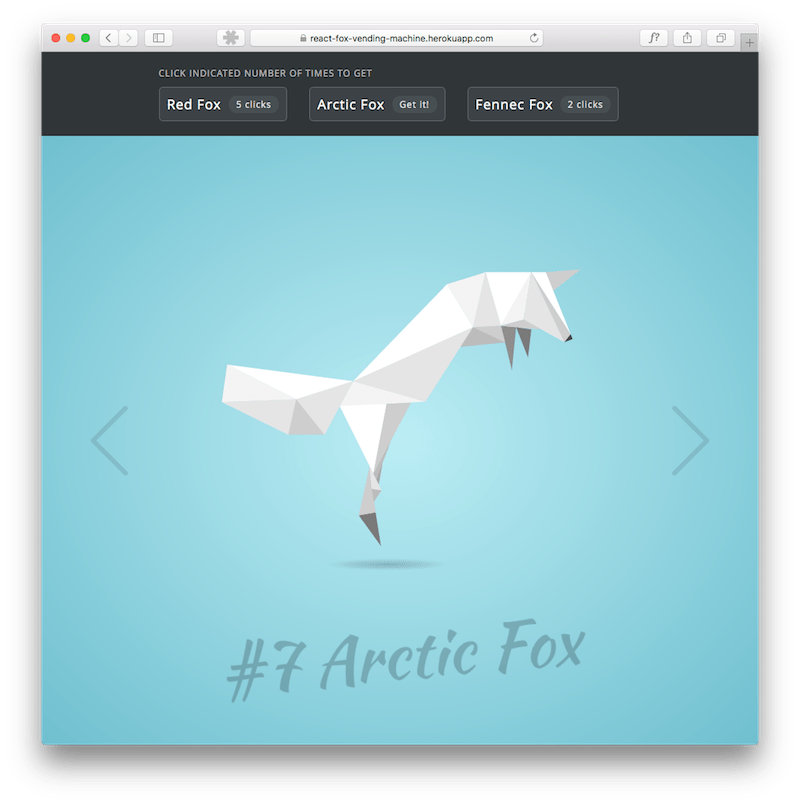

# react-fox-vending-machine

## Working demo

[https://react-fox-vending-machine.herokuapp.com/](https://react-fox-vending-machine.herokuapp.com/)

  1. To "buy" a virtual fox, click indicated number of times on the selected button
  2. You can get as many foxes as you like
  3. Navigate through your collection using arrows on the screen

  

## Install

Clone repository and run:

```sh
$ npm install
```

## Development

```sh
$ npm start
```

Go to [http://localhost:3001](http://localhost:3001) to see the vending machine project.

## Credits
  - React Boilerplate: [react-webpack-boilerplate](https://github.com/srn/react-webpack-boilerplate)
  - Concept of drawing animals: [Spieces-in-pieces](http://species-in-pieces.com/)
  - Fonts: [Google Fonts](https://fonts.google.com)
  - Animation Engine: [React Motion](https://github.com/chenglou/react-motion)

MIT © [Bart Gryszko](https://twitter.com/bgryszko)
